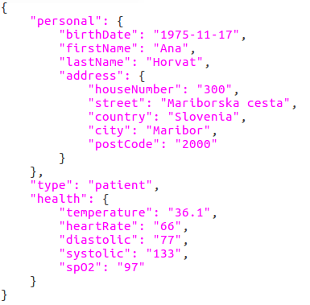
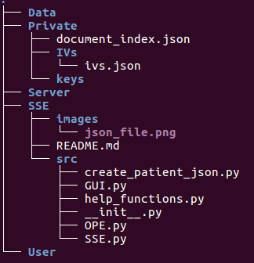
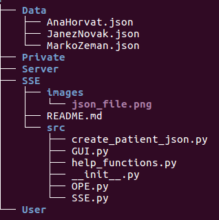
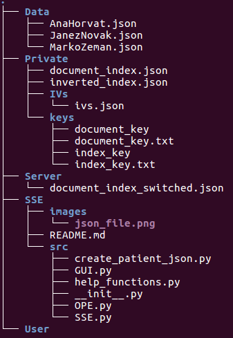
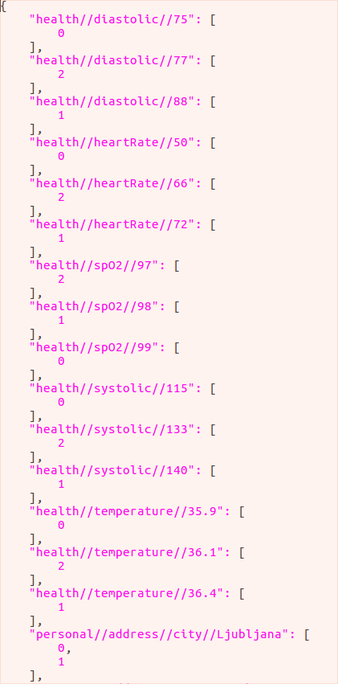
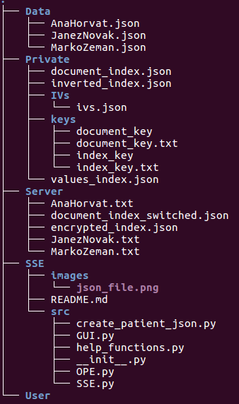
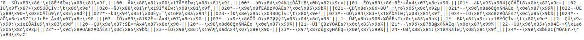

# Searchable Symmetric Encryption with order preservation

### _About_
Searchable Symmetric Encryption enables search over encrypted data.  
Order preservation gives us possibility to search over encrypted data not only by exact match but also with operators like < and >. 

### _Solution_
Solution of the problem is based on this [article](https://hcis-journal.springeropen.com/articles/10.1186/s13673-015-0039-9).  

Search steps over encrypted data:
1. Create three example json data files. You can create examples if you execute python file _create\_patient\_json.py_. One of examples is shown in the picture.  


2. Create index and document key and save them: _SSE_ class method _generate\_and\_save\_keys_.

3. Generate IVs and update document index - _SSE_ class method _update\_IVs\_and\_doc\_index_.

4. Create switched document index for server - _SSE_ class method _create\_switched\_document\_index_.

5. Create inverted document index - _OPE_ class method _create\_inverted\_keyword\_index_.

6. Create index for all distinct values for every field - _OPE_ class method _create\_index\_of\_values_.

7. Encrypt inverted document index with index key and save it on server - _OPE_ class method _encrypt\_index_.

8. Encrypt all example documents with document key and save it on server - _OPE_ class method _encrypt\_documents_.

9. Search over encrypted data - _OPE_ class methods _generate\_search\_token_ and _search_.

10. Copy encrypted files that fit the query to user - _OPE_ class method _copy\_encrypted\_files\_to\_user_.

11. Decrypt files at user with document key - _OPE_ class method _decrypt\_documents_.


### _Instructions for establishing working directory_
Opiši direktorijsko strukturo. Testiraj v drugi mapi od začetka.

1. Create empty folder and name it _TestSSE_.

2. Inside this directory create five more folders and name them _Data_, _Private_, _Server_, _SSE_, _User_.

3. Inside _Private_ directory create empty folders named _keys_ and _IVs_.

4. Inside _Private_ directory create json file _document\_index.json_ with empty brackets {}.

5. Inside _Private/IVs_ directory create json file _ivs.json_ with empty brackets {}.

6. Inside _SSE_ directory copy all files downloaded from github link <https://github.com/markozeman/SSE.git>.

Your directory structure should look something like this:  


7. Inside _SSE/src_ directory execute _create\_patient\_json.py_ file.

8. In terminal move to _SSE/src_ directory, start _ipython_ and execute this commands:
```python
from SSE import SSE
sse = SSE()

sse.generate_and_save_keys()
sse.update_IVs_and_doc_index()
```

After that your directory structure should look something like this:  


9. In terminal move to _SSE/src_ directory, start _ipython_ and execute this commands:
```python
from SSE import SSE
from OPE import OPE
sse = SSE()
ope = OPE()

sse.create_switched_document_index()
ope.create_inverted_keyword_index()
```

After that your directory structure should look something like this:  


Inverted index should look like this:  


10. In terminal move to _SSE/src_ directory, start _ipython_ and execute this commands:
```python
from OPE import OPE
ope = OPE()

ope.create_index_of_values()
ope.encrypt_index()
ope.encrypt_documents()
```

After that your directory structure should look something like this:    


Encrypted file of Janez Novak should look like this:  


11. Now we have everything prepared to use graphical interface to search over data.


### _GUI usage example_ 
GUI - razloži, kako se zažene in uporablja.


* * * 

In our solution we used Python 3.5.2 and Anaconda 3.


